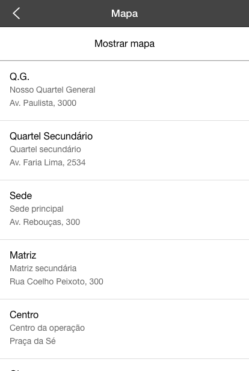
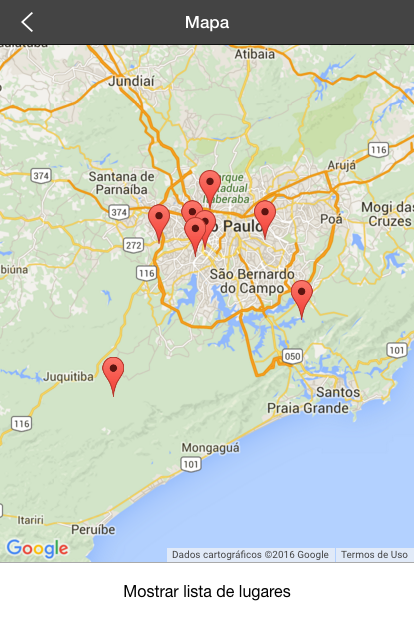

# m-map

## O que é?

M-map é um moblet que permite com que você visualize uma lista de lugares e seus arredores num mapa ou numa lista.

Para usar este moblet você só precisa inserir os endereço corretos, que serão verificados e posicionados conforme o Google Maps.

